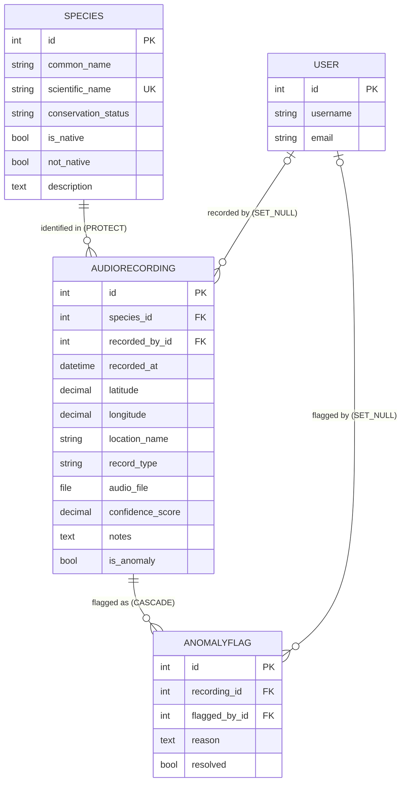

# Entity Relationship Diagram

## Relationships

| Relationship | Type | on_delete | Meaning |
|---|---|---|---|
| Species → AudioRecording | One to many | PROTECT | A species cannot be deleted if it has recordings |
| User → AudioRecording | One to many (optional) | SET_NULL | Deleting a user keeps their recordings, sets recorded_by to null |
| AudioRecording → AnomalyFlag | One to many | CASCADE | Deleting a recording deletes all its flags |
| User → AnomalyFlag | One to many (optional) | SET_NULL | Deleting a user keeps the flag, sets flagged_by to null |

## Choice fields

**ConservationStatus** (on Species.conservation_status)

| Code | Label |
|---|---|
| LC | Least Concern |
| NT | Near Threatened |
| VU | Vulnerable |
| EN | Endangered |
| CR | Critically Endangered |
| DD | Data Deficient |
| NE | Not Evaluated |

**RecordType** (on AudioRecording.record_type)

| Code | Label |
|---|---|
| HO | Human Observation |
| MO | Machine Observation |
| PS | Preserved Specimen |
| MS | Material Sample |
| OTHER | Other |