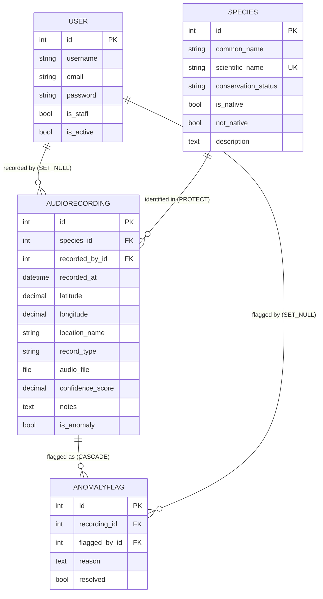

# Entity Relationship Diagram

```mermaid
erDiagram
  USER {
    int id PK
    string username
    string email
    string password
    bool is_staff
    bool is_active
  }
  SPECIES {
    int id PK
    string common_name
    string scientific_name UK
    string conservation_status
    bool is_native
    bool not_native
    text description
  }
  AUDIORECORDING {
    int id PK
    int species_id FK
    int recorded_by_id FK
    datetime recorded_at
    decimal latitude
    decimal longitude
    string location_name
    string record_type
    file audio_file
    decimal confidence_score
    text notes
    bool is_anomaly
  }
  ANOMALYFLAG {
    int id PK
    int recording_id FK
    int flagged_by_id FK
    text reason
    bool resolved
  }
 
  USER ||--o{ AUDIORECORDING : "recorded by (SET_NULL)"
  SPECIES ||--o{ AUDIORECORDING : "identified in (PROTECT)"
  AUDIORECORDING ||--o{ ANOMALYFLAG : "flagged as (CASCADE)"
  USER ||--o{ ANOMALYFLAG : "flagged by (SET_NULL)"
```
 
## Relationships
 
| Relationship | Type | on_delete | Meaning |
|---|---|---|---|
| Species → AudioRecording | One to many | PROTECT | A species cannot be deleted if it has recordings |
| User → AudioRecording | One to many (optional) | SET_NULL | Deleting a user keeps their recordings, sets recorded_by to null |
| AudioRecording → AnomalyFlag | One to many | CASCADE | Deleting a recording deletes all its flags |
| User → AnomalyFlag | One to many (optional) | SET_NULL | Deleting a user keeps the flag, sets flagged_by to null |
 
## Choice fields
 
**ConservationStatus** (on Species.conservation_status)
 
| Code | Label |
|---|---|
| LC | Least Concern |
| NT | Near Threatened |
| VU | Vulnerable |
| EN | Endangered |
| CR | Critically Endangered |
| DD | Data Deficient |
| NE | Not Evaluated |
 
**RecordType** (on AudioRecording.record_type)
 
| Code | Label |
|---|---|
| HO | Human Observation |
| MO | Machine Observation |
| PS | Preserved Specimen |
| MS | Material Sample |
| OTHER | Other |
 
## Service layer
 
The following service functions sit between views and models:
 
| Service function | Purpose |
|---|---|
| `create_recording(user, data)` | Creates a recording, validates confidence score |
| `update_recording(user, recording, data)` | Updates recording, enforces ownership |
| `delete_recording(user, recording)` | Deletes recording, enforces ownership |
| `flag_recording(user, recording, reason)` | Flags a recording, prevents re-flagging resolved recordings |
| `resolve_flag(user, flag)` | Resolves a flag, clears is_anomaly on the recording |
| `dismiss_flag(user, flag)` | Dismisses a flag without resolving |
| `create_species(data)` | Creates a species, checks for duplicate scientific name |
 
## Authentication
 
| URL | View | Access |
|---|---|---|
| /login/ | LoginView | Public |
| /register/ | RegisterView | Public |
| /logout/ | LogoutView | POST only |
| /recordings/add/ | RecordingCreateView | Login required |
| /recordings/\<pk\>/edit/ | RecordingUpdateView | Login required + owner only |
| /recordings/\<pk\>/delete/ | RecordingDeleteView | Login required + owner only |
| /species/add/ | SpeciesCreateView | Login required |
| /anomalies/add/\<pk\>/ | AnomalyCreateView | Login required |
| /anomalies/\<pk\>/edit/ | AnomalyUpdateView | Login required + owner only |
| /anomoalies/\<pk\>/delete/ | AnomalyDeleteView | Login required + owner only |

